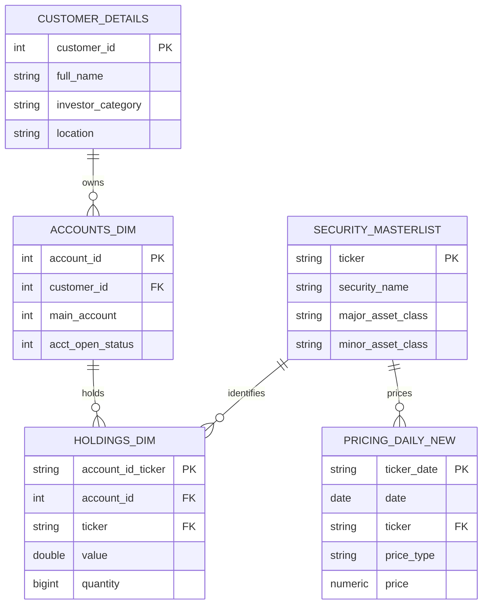

# SQL Database Creation - Portfolio Analysis

## Project goal

This project is a database engineering exercise, not a portfolio optimization tool. The goal was to design, build, and populate a relational database from scratch in MySQL: a normalized schema, primary and foreign keys, and parameterized stored procedures that work end to end.

The portfolio return, risk, and Sharpe ratio analysis was included because the assignment required it to be built in SQL, but this is not how the analysis would be done in practice. In a real workflow, portfolio optimization, covariance matrices, and efficient frontier calculations would be done in Python (numpy, pandas, scipy.optimize, PyPortfolioOpt) or R (PerformanceAnalytics, quantmod), languages built for numerical and statistical computation in a way SQL isn't.

All analysis metrics (returns, correlations, volatility, Sharpe ratios) were computed manually in SQL, including working around functions not natively available in this MySQL version, such as `CORR()`. The full analysis, results, charts, and recommendations are documented in the [PDF report](Client_Report_PortfolioAnalysis.pdf). The `.sql` file and schema below are the main deliverable.

Built for an Individual Final Assessment in SQL & Data Management, around a fictional Ultra High Net Worth client.

## Database schema

Five tables, normalized around the client and the securities they hold.



| Table | Role | Primary key | Foreign keys |
|---|---|---|---|
| `customer_details` | Client identity and category | `customer_id` | none |
| `accounts_dim` | Accounts owned by a client | `account_id` | `customer_id` to customer_details |
| `security_masterlist` | Reference data per ticker | `ticker` | none |
| `holdings_dim` | Position value and quantity per account and ticker | `account_id_ticker` | `account_id` to accounts_dim, `ticker` to security_masterlist |
| `pricing_daily_new` | Daily adjusted close price history | `ticker_date` | `ticker` to security_masterlist |

Full DDL, including column types and constraints, is in `sql_simoncelli_capital.sql`.

## What's in this repo

```
sql/
  simoncelli_capital_analysis.sql   (full schema plus 5 parameterized stored procedures)
report/
  Simoncelli_Capital_Portfolio_Analysis.pdf   (final client facing report with full analysis)
data/
  (raw price CSVs go here, see note below)
scripts/
  (yfinance download script goes here, see note below)
README.md
```

## Stored procedures

Five parameterized stored procedures, with the time window passed in as an input parameter, cover the full analysis: returns (`q1_returns`), correlations (`q2_correlations`), volatility (`q3_risk`), current portfolio Sharpe ratio (`q_sharpe`), and optimized portfolio Sharpe ratio (`new_sharpe`). All logic, results, and interpretation are in the [PDF report](report/Simoncelli_Capital_Portfolio_Analysis.pdf).

## Data pipeline

Daily adjusted close pricing was sourced via the yfinance Python API (`auto_adjust=False`), producing long format CSVs, then loaded into MySQL Workbench through generated INSERT statements. Holding quantities are derived from position value divided by live market price at the reporting date.

## Tools

- MySQL 8 / MySQL Workbench
- Python (yfinance) for data download and chart generation

## Scope and limitations

- SQL is not the natural tool for portfolio optimization. There is no native `CORR()` support in this MySQL version (worked around manually), no covariance matrix support, and no built in solver for mean variance optimization. The optimized portfolio in the report is a small, manually evaluated set of candidate weights, not the output of a true optimizer such as `scipy.optimize.minimize` or PyPortfolioOpt's `EfficientFrontier`.
- Fictional client, academic exercise. All client data, holdings, and recommendations are for coursework only and are not real investment advice.

## Skills demonstrated

- Relational schema design with primary and foreign keys across 5 tables
- Parameterized MySQL stored procedures, with IN parameters driving dynamic date window logic via DATE_SUB
- Window functions (FIRST_VALUE, LAG) for time series return and volatility calculations
- Manual statistical computation in SQL where native functions were unavailable
- ETL pipeline: API to CSV to SQL INSERT (yfinance to convertcsv.com to MySQL Workbench)

## Author

Individual assessment, not a team project.
